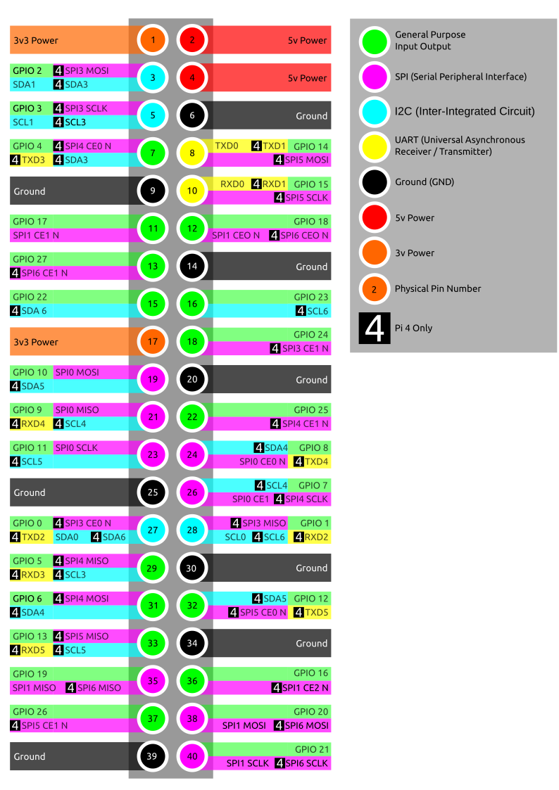

# Пример мигания светодиодом

## Распиновка GPIO

Для программирования важно, что есть пины могут считать двумя способами:
* физическое расположение, как на плате,
* логическое, пины тогда именуются "gpioXX"

В примере с командной строкой используются логисечкие пины, которые на картинке обозначены зеленым и подписаны gpioXX. 

В примере на питоне используются физические пины, но можно задачать и логические, зависит от пераметра в `GPIO.setmode()`, см. комментарий к коду.



## используем прямой доступ к пинам через /sys

В этом примере используем pin 18
```bash
#   приготавливает пин для работы с ним
echo "24" > /sys/class/gpio/export                  

# задает пину режим вывода (как pinMode в Ардуино)
echo "out" > /sys/class/gpio/gpio24/direction

# Устанавливает высокий уровень на пин 18 (аналог digitalWrite)
echo "1" > /sys/class/gpio/gpio24/value

# Устанавливает ybprbq уровень на пин 18 (аналог digitalWrite)
echo "0" > /sys/class/gpio/gpio24/value
```

Для справки - чтение состояния пина (digitalRead)
```bash
echo "4" > /sys/class/gpio/export
echo "in" > /sys/class/gpio/gpio4/direction
cat /sys/class/gpio/gpio4/value
```

## Пример на питоне

откройте nano blink.py и скопируйте туда код:

```python
import RPi.GPIO as GPIO # импорт библиотеки
from time import sleep # функция sleep (аналог delay)
 
GPIO.setwarnings(False) # игнорируем предупреждения
GPIO.setmode(GPIO.BOARD) # режим физической маркировки пинов (как на самой плате) или GPIO.BCM
GPIO.setup(8, GPIO.OUT, initial=GPIO.LOW) # режим работы пина на вывод, начальное значение низкое.

while True: # бесконечный цикл (аналон loop()
 GPIO.output(8, GPIO.HIGH) # подаем высокий сигнал
 sleep(1) # ждем секунду
 GPIO.output(8, GPIO.LOW) # подаем низкий
 sleep(1) # ждем секунду
```

Запуск программы:

```bash
python blink.py
```
